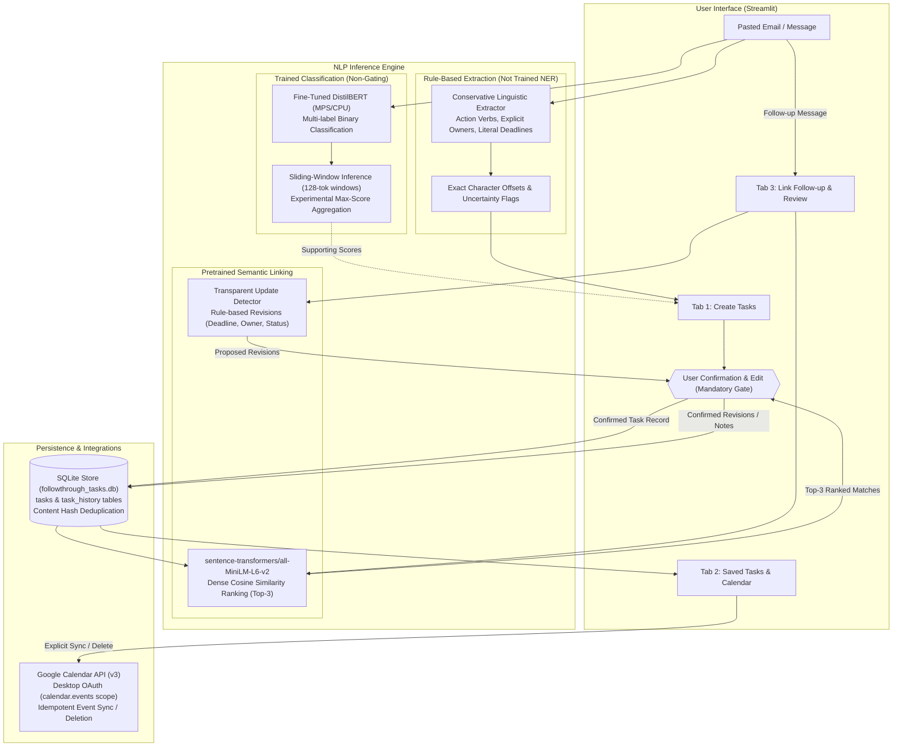
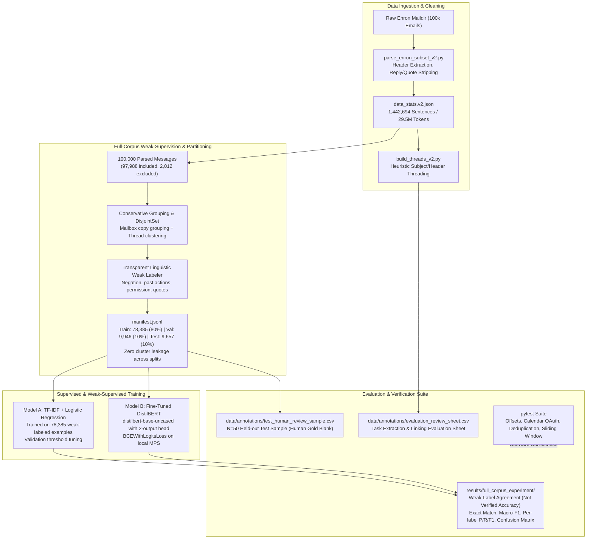

# FollowThrough Architecture & Pipeline Diagrams

## 1. System Architecture Diagram

```mermaid
graph TD
    subgraph UI ["User Interface (Streamlit)"]
        InputMsg["Pasted Email / Message"]
        UI_Tab1["Tab 1: Create Tasks"]
        UI_Tab2["Tab 2: Saved Tasks & Calendar"]
        UI_Tab3["Tab 3: Link Follow-up & Review"]
        UserReview{{"User Confirmation & Edit (Mandatory Gate)"}}
    end

    subgraph NLP_Inference ["NLP Inference Engine"]
        subgraph Classification ["Trained Classification (Non-Gating)"]
            DistilBERT["Fine-Tuned DistilBERT (MPS/CPU)<br/>Multi-label Binary Classification"]
            SlidingWindow["Sliding-Window Inference (128-tok windows)<br/>Experimental Max-Score Aggregation"]
        end
        subgraph Extraction ["Rule-Based Extraction (Not Trained NER)"]
            TaskExtractor["Conservative Linguistic Extractor<br/>Action Verbs, Explicit Owners, Literal Deadlines"]
            OffsetTracker["Exact Character Offsets & Uncertainty Flags"]
        end
        subgraph SemanticLinking ["Pretrained Semantic Linking"]
            MiniLM["sentence-transformers/all-MiniLM-L6-v2<br/>Dense Cosine Similarity Ranking (Top-3)"]
            UpdateDetector["Transparent Update Detector<br/>Rule-based Revisions (Deadline, Owner, Status)"]
        end
    end

    subgraph Persistence ["Persistence & Integrations"]
        SQLiteDB[("SQLite Store (followthrough_tasks.db)<br/>tasks & task_history tables<br/>Content Hash Deduplication")]
        GCal["Google Calendar API (v3)<br/>Desktop OAuth (calendar.events scope)<br/>Idempotent Event Sync / Deletion"]
    end

    InputMsg --> DistilBERT
    DistilBERT --> SlidingWindow
    SlidingWindow -.->|"Supporting Scores"| UI_Tab1

    InputMsg --> TaskExtractor
    TaskExtractor --> OffsetTracker
    OffsetTracker --> UI_Tab1

    UI_Tab1 --> UserReview
    UserReview -->|"Confirmed Task Record"| SQLiteDB

    SQLiteDB --> UI_Tab2
    UI_Tab2 -->|"Explicit Sync / Delete"| GCal

    SQLiteDB --> MiniLM
    InputMsg -->|"Follow-up Message"| UI_Tab3
    UI_Tab3 --> MiniLM
    UI_Tab3 --> UpdateDetector
    MiniLM -->|"Top-3 Ranked Matches"| UserReview
    UpdateDetector -->|"Proposed Revisions"| UserReview
    UserReview -->|"Confirmed Revisions / Notes"| SQLiteDB
```

---

## 2. Data, Training & Evaluation Pipeline Diagram

```mermaid
graph TD
    subgraph DataIngestion ["Data Ingestion & Cleaning"]
        EnronRaw["Raw Enron Maildir (100k Emails)"]
        CleaningScript["parse_enron_subset_v2.py<br/>Header Extraction, Reply/Quote Stripping"]
        CleanCorpus["data_stats.v2.json<br/>1,442,694 Sentences / 29.5M Tokens"]
        ThreadBuilder["build_threads_v2.py<br/>Heuristic Subject/Header Threading"]
    end

    subgraph FullCorpusPipeline ["Full-Corpus Weak-Supervision & Partitioning"]
        FullCorpus["100,000 Parsed Messages<br/>(97,988 included, 2,012 excluded)"]
        DupGrouping["Conservative Grouping & DisjointSet<br/>Mailbox copy grouping + Thread clustering"]
        WeakLabeler["Transparent Linguistic Weak Labeler<br/>Negation, past actions, permission, quotes"]
        ManifestSplit["manifest.jsonl<br/>Train: 78,385 (80%) | Val: 9,946 (10%) | Test: 9,657 (10%)<br/>Zero cluster leakage across splits"]
    end

    subgraph ModelTraining ["Supervised & Weak-Supervised Training"]
        BaselineTFIDF["Model A: TF-IDF + Logistic Regression<br/>Trained on 78,385 weak-labeled examples<br/>Validation threshold tuning"]
        DistilBERTTuning["Model B: Fine-Tuned DistilBERT<br/>distilbert-base-uncased with 2-output head<br/>BCEWithLogitsLoss on local MPS"]
    end

    subgraph Evaluation ["Evaluation & Verification Suite"]
        WeakAgreementEval["results/full_corpus_experiment/<br/>Weak-Label Agreement (Not Verified Accuracy)<br/>Exact Match, Macro-F1, Per-label P/R/F1, Confusion Matrix"]
        HumanReviewSuite["data/annotations/test_human_review_sample.csv<br/>N=50 Held-out Test Sample (Human Gold Blank)"]
        PilotPipelineEval["data/annotations/evaluation_review_sheet.csv<br/>Task Extraction & Linking Evaluation Sheet"]
        WorkflowTests["pytest Suite<br/>Offsets, Calendar OAuth, Deduplication, Sliding Window"]
    end

    EnronRaw --> CleaningScript
    CleaningScript --> CleanCorpus
    CleanCorpus --> ThreadBuilder
    CleanCorpus --> FullCorpus
    FullCorpus --> DupGrouping
    DupGrouping --> WeakLabeler
    WeakLabeler --> ManifestSplit

    ManifestSplit --> BaselineTFIDF
    ManifestSplit --> DistilBERTTuning

    BaselineTFIDF --> WeakAgreementEval
    DistilBERTTuning --> WeakAgreementEval
    ManifestSplit --> HumanReviewSuite
    ThreadBuilder --> PilotPipelineEval
    WorkflowTests -.->|"Software Correctness"| Evaluation
```

